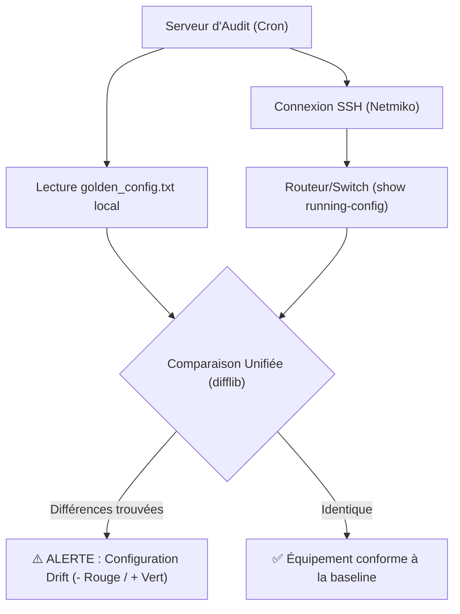

#  Network Configuration Drift Detector

Dans l'idéal, toute modification réseau passe par un pipeline d'Infrastructure as Code (IaC). Dans la réalité, les modifications d'urgence en "out-of-band" (en direct sur l'équipement à 3h du matin) arrivent et créent une dérive de configuration (Configuration Drift).

Ce script se connecte directement aux équipements réseaux via SSH (Cisco, Juniper, Arista...) en utilisant `netmiko`, extrait la configuration en cours d'exécution (`running-config`), et la compare à un fichier de référence (`golden_config.txt`) pour repérer les ajouts ou suppressions non documentés.

##  Architecture d'Audit Réseau


# Fonctionnalités
Multi-Constructeurs : Supporte nativement des dizaines d'OS réseaux grâce à la puissance de netmiko.

Zero-Bloat : Affichage des différences (Diff) coloré via les codes ANSI natifs du terminal (pas de dépendance colorama inutile).

Format Unifié : Génère des rapports de différences standardisés, parfaits pour l'envoi de logs vers un SIEM ou par e-mail.

# Installation
```Bash
git clone https://github.com/FilouCosmos/net-config-drift-detector.git
cd net-config-drift-detector
pip install -r requirements.txt
```
# Configuration & Utilisation
Placez la configuration de référence de votre équipement dans un fichier nommé golden_config.txt à la racine du script.

Éditez le dictionnaire TARGET_DEVICE dans drift_detector.py avec l'IP et les identifiants SSH de votre équipement cible.

Lancez l'audit :

```Bash
python3 drift_detector.py
```
 Audit Automatisé (Cron)
Pour transformer ce script en véritable outil de supervision réseau (NOC), planifiez-le pour qu'il s'exécute la nuit (hors fenêtres de maintenance). Éditez votre crontab (crontab -e) :

```Bash
0 3 * * * /usr/bin/python3 /chemin/vers/net-config-drift-detector/drift_detector.py > /v
```
